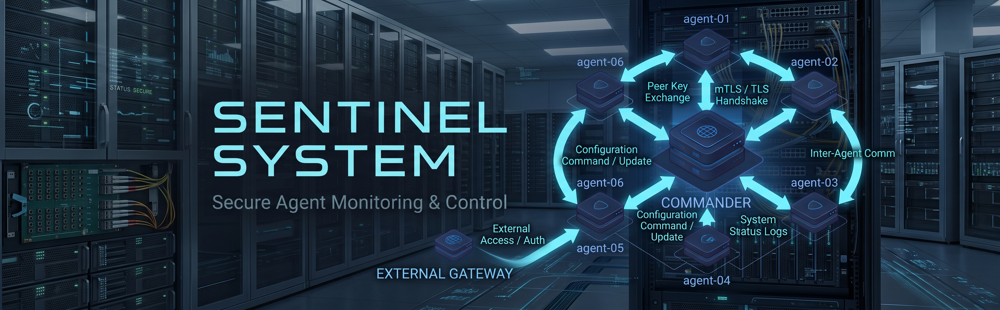

<p align="center">
  
</p>


# Sentinel System

**Sentinel System** is a security-focused monitoring and agent management platform designed for authenticated communication between a central **Commander** and distributed **Scout Agents**.

The project is currently in **Alpha** and focuses on secure agent communication, authentication, task authorization, telemetry validation, and a defense-in-depth security architecture.

> ⚠️ **Project Status: Alpha**
>
> Sentinel System is under active development and is **not production-ready**.

---

## 🏗️ Architecture

```text
                    ┌──────────────────────┐
                    │      Web Client      │
                    │   Commander Panel   │
                    └──────────┬───────────┘
                               │
                            HTTPS
                               │
                    ┌──────────▼───────────┐
                    │      Commander       │
                    │                      │
                    │ Authentication       │
                    │ Session Management   │
                    │ Task Scheduler       │
                    │ Agent Gateway        │
                    └──────────┬───────────┘
                               │
                         WSS + mTLS
                               │
              ┌────────────────┴────────────────┐
              │                                 │
      ┌───────▼────────┐               ┌────────▼───────┐
      │   Scout Agent  │               │   Scout Agent  │
      │                │               │                 │
      │ Task Execution │               │ Task Execution  │
      │ Telemetry      │               │ Telemetry       │
      └────────────────┘               └─────────────────┘
                               │
                         ┌─────▼─────┐
                         │ Database  │
                         └───────────┘
```

> The current Alpha architecture is evolving. Browser/API and Agent traffic separation is planned as part of the network architecture hardening phase.

---

# ✨ Current Features

## 🔐 Authentication & Sessions

- User authentication
- bcrypt password hashing
- Login rate limiting
- Login failure delay
- Session expiration
- Secure cookie configuration
- HTTP request body size limits
- WebSocket origin validation

---

## 🛡️ Secure Agent Communication

Scout ↔ Commander communication uses:

- TLS 1.3
- Mutual TLS (mTLS)
- Certificate-based Agent authentication
- Secure WebSocket (`wss://`)
- Certificate chain validation
- Short-lived authenticated tasks

The system is designed so that an Agent must establish a trusted cryptographic identity before communicating with Commander.

---

# 📡 WebSocket Security

The Agent Gateway includes multiple protections against malformed, oversized, replayed, or abusive traffic.

### Implemented

- WebSocket message size limits
- Read deadlines
- Write deadlines
- Pong/keepalive handling
- Concurrent connection state protection
- Safe concurrent WebSocket writes
- Unknown message type rejection
- Agent identity validation
- Telemetry validation

---

# 🎯 Task Authorization

Tasks sent to Scout Agents contain security metadata.

Example:

```json
{
  "type": "PING_ISTEGI",
  "task_id": "uuid",
  "target": "example.com",
  "agent": "scout-01",
  "issued_at": "...",
  "expires_at": "..."
}
```

### Implemented protections

- Unique Task IDs
- Task ownership validation
- Task timestamp validation
- Automatic task expiration
- Replay protection
- Duplicate Task ID detection
- Strict target validation
- Agent identity validation

Tasks are intentionally short-lived to reduce the impact of replayed or delayed commands.

---

# 📊 Agent Telemetry

Scout Agents report execution results back to Commander.

Telemetry validation includes:

- CPU usage
- RAM usage
- Disk usage
- HTTP status
- Execution time
- Agent identity
- Task ID

Example:

```text
Scout
  │
  ├── Execute Task
  │
  └── RAPOR
        │
        ├── Task ID
        ├── Agent
        ├── Target
        ├── Status
        ├── Time
        └── System Metrics
```

Commander validates received telemetry before processing it.

---

# ⚙️ Scout Agent

Scout is the lightweight agent responsible for executing authorized monitoring tasks.

Current capabilities include:

- Secure Commander connection
- mTLS authentication
- Agent registration
- Task validation
- Target validation
- Ping execution
- Telemetry collection
- Result reporting
- Automatic reconnect handling

Unsupported or unknown commands are rejected.

---

# 🔑 Cryptography & PKI

Sentinel uses standard cryptographic protocols and certificate-based authentication rather than application-level custom cryptography.

The current development environment uses a private certificate authority hierarchy for:

- Commander authentication
- Scout authentication
- Certificate chain validation
- Local development

Encrypted PKCS#8 private key support is also implemented.

> Private keys, credentials, certificates containing sensitive material, and environment secrets must never be committed to the repository.

---

# 🗄️ Database

Commander uses a database-backed architecture for:

- Users
- Agents
- Targets
- Logs
- Monitoring results

Database credentials are supplied through environment-based configuration.

Sensitive credentials are not hardcoded into the application.

---

# 🧪 Validation

The current Alpha implementation has been validated with:

```bash
go test ./...
```

Build validation:

```bash
go build ./cmd/commander
go build ./cmd/scout
```

Runtime testing has covered:

- mTLS connection
- Agent registration
- Task execution
- Telemetry reporting
- Agent disconnect
- Agent reconnect
- WebSocket connection lifecycle

---

## 🗺️ Roadmap

### 🔐 Security & Core Architecture

- [x] **Phase 1 — Agent Gateway Hardening**
  - mTLS
  - TLS 1.3
  - WebSocket hardening
  - Task authorization
  - Replay protection
  - Agent telemetry validation
  - Connection and message limits

- [ ] **Phase 2 — Network Architecture Hardening**
  - Separate browser HTTPS and Scout WSS listeners
  - Network segmentation
  - Reverse proxy architecture
  - Internal service isolation

- [x] **Phase 3 — Agent Identity Hardening**
  - Certificate-bound agent identity
  - Certificate fingerprint validation
  - Agent name collision protection
  - Secure agent enrollment
  - Agent revocation

- [x] **Phase 4 — Analyst Security**
  - Harden Analyst endpoints
  - Authentication improvements
  - CSP hardening
  - Session security
  - API protection

- [ ] **Phase 5 — Authorization & RBAC**
  - Role-based access control
  - Fine-grained permissions
  - Resource-level authorization
  - Administrative roles

- [ ] **Phase 6 — API & Resource Protection**
  - API rate limiting
  - Export protection
  - Request size limits
  - Resource quotas
  - Abuse prevention

- [ ] **Phase 7 — Audit Logging**
  - Security audit trail
  - Authentication events
  - Administrative actions
  - Agent lifecycle events
  - Task execution history

- [ ] **Phase 8 — PKI & Certificate Lifecycle**
  - Certificate rotation
  - Agent certificate renewal
  - Certificate revocation
  - Automated enrollment
  - CA lifecycle management

- [ ] **Phase 9 — Cryptographic Agility & PQC Readiness**
  - Algorithm agility
  - Crypto abstraction layer
  - Modern key exchange support
  - Post-quantum migration readiness
  - Hybrid cryptographic designs where appropriate

- [ ] **Phase 10 — Production Hardening**
  - Non-root containers
  - Secret management
  - Health/readiness endpoints
  - Production logging
  - Backup and recovery
  - Operational hardening

---

### 📊 Monitoring Engine

- [ ] **Phase 11 — Monitoring Engine**
  - Central monitoring engine
  - Metric collection pipeline
  - Metric normalization
  - Threshold evaluation
  - Monitoring state management
  - Real-time status tracking

- [ ] **Phase 12 — Sensor Framework**
  - Pluggable sensor architecture
  - CPU monitoring
  - RAM monitoring
  - Disk monitoring
  - Ping monitoring
  - TCP port monitoring
  - HTTP/HTTPS monitoring
  - DNS monitoring
  - Process monitoring
  - Service monitoring
  - Custom sensors

- [ ] **Phase 13 — Historical Monitoring & Alerting**
  - Historical metric storage
  - Time-series data
  - Threshold-based alerts
  - Alert severity levels
  - Alert acknowledgment
  - Alert recovery
  - Alert history
  - Notification policies

- [ ] **Phase 14 — Discovery & Network Monitoring**
  - Automatic host discovery
  - Network discovery
  - Service discovery
  - SNMP monitoring
  - Network interface monitoring
  - Device inventory
  - Network topology discovery
  - Network maps

---

### 🔭 Observability

- [ ] **Phase 15 — Observability Stack**
  - Metrics
  - Logs
  - Events
  - Distributed traces
  - Unified telemetry model
  - OpenTelemetry support
  - Telemetry correlation

- [ ] **Phase 16 — Dependency Mapping & Smart Alerting**
  - Service dependency maps
  - Infrastructure dependencies
  - Root-cause-oriented alerting
  - Alert correlation
  - Alert deduplication
  - Alert suppression
  - Dependency-aware notifications

- [ ] **Phase 17 — Synthetic Monitoring & SLA**
  - HTTP synthetic checks
  - API monitoring
  - DNS synthetic checks
  - TCP connectivity checks
  - Availability monitoring
  - SLA calculations
  - Uptime history
  - Maintenance windows

---

### 📈 Dashboard & Operations

- [ ] **Phase 18 — Dashboard, Maps & Reporting**
  - Custom dashboards
  - Real-time graphs
  - Historical graphs
  - Network maps
  - Infrastructure maps
  - Monitoring overviews
  - PDF/Excel reporting
  - Scheduled reports
  - SLA reports

- [ ] **Phase 19 — Templates, Integrations & Automation**
  - Monitoring templates
  - Windows templates
  - Linux templates
  - Docker templates
  - Database templates
  - Web server templates
  - Reusable sensor configurations
  - Webhooks
  - Email notifications
  - Telegram notifications
  - External integrations
  - Automated agent deployment

- [ ] **Phase 20 — Advanced Security Monitoring**
  - File integrity monitoring
  - Security event monitoring
  - Authentication monitoring
  - Suspicious activity detection
  - Security-focused sensors
  - Security scoring
  - Threat-oriented telemetry
  - Security event correlation

---

### 🌐 Distributed & Enterprise Architecture

- [ ] **Phase 21 — Distributed Architecture**
  - Multiple Commanders
  - Distributed Scouts
  - Remote monitoring nodes
  - Regional monitoring
  - High availability
  - Failover
  - Distributed task scheduling

- [ ] **Phase 22 — Multi-Tenant & Cloud-Ready Architecture**
  - Tenant isolation
  - Organization management
  - Tenant-level RBAC
  - Resource isolation
  - Cloud deployment support
  - Horizontal scaling
  - Centralized management

- [ ] **Phase 23 — Advanced Automation & Intelligence**
  - Automated remediation
  - Event-driven actions
  - Intelligent anomaly detection
  - Capacity forecasting
  - Automated root-cause assistance
  - Advanced operational insights

---

### 🎯 Long-Term Vision

Sentinel System is designed to evolve from a secure agent-management platform into a complete **self-hosted infrastructure monitoring, observability and security platform**.

The long-term architecture is built around the existing security core:

```text
                         SENTINEL SYSTEM
                                │
                ┌───────────────┼───────────────┐
                │               │               │
           MONITORING       SECURITY       OBSERVABILITY
                │               │               │
             Sensors          FIM            Metrics
             Discovery        Events          Logs
             SNMP             Auth            Traces
             Network          Security        OpenTelemetry
                │               │               │
                └───────────────┼───────────────┘
                                │
                         MONITORING ENGINE
                                │
                           ALERT ENGINE
                                │
                ┌───────────────┼───────────────┐
                │               │               │
              Email          Telegram        Webhook
                │               │               │
                └───────────────┼───────────────┘
                                │
                            DASHBOARD
                                │
                ┌───────────────┼───────────────┐
                │               │               │
              Maps             SLA           Reports
                                │
                         Multi-Tenant
                                │
                    Self-Hosted / Cloud
```

The existing **Commander → Scout → Secure Agent Gateway** architecture remains the foundation of the platform.

New monitoring, observability and security capabilities are intended to be implemented as additional layers on top of this foundation rather than replacing the existing core.

> **Security first. Monitoring second. Observability and automation on top.**

# 🧭 Security Principles

Sentinel is designed around several core security principles.

### Zero Trust

Every Agent must authenticate before communicating with Commander.

### Least Privilege

Components and users should receive only the permissions they require.

### Defense in Depth

Security should not depend on a single control.

```text
TLS
 ↓
mTLS
 ↓
Agent Identity
 ↓
Authorization
 ↓
Task Validation
 ↓
Replay Protection
 ↓
Input Validation
 ↓
Audit Logging
```

### Secure by Default

Security controls should be enabled by default rather than requiring operators to manually enable them.

### Cryptographic Agility

The system should be able to adopt stronger cryptographic algorithms as standards evolve.

---

# 🛠️ Technology Stack

### Backend

- Go
- WebSocket
- TLS 1.3
- mTLS
- bcrypt
- MySQL

### PKI

- Smallstep
- X.509 certificates
- Standard cryptographic primitives

### Frontend

- HTML
- CSS
- JavaScript
- Chart.js

### Infrastructure

- Linux / Windows development environments
- Reverse-proxy compatible architecture
- Docker support under development

---

# 📁 Project Structure

```text
sentinel-system/
│
├── cmd/
│   ├── commander/
│   │   └── main.go
│   │
│   └── scout/
│       └── main.go
│
├── internal/
│   └── models/
│       └── message.go
│
├── web/
│   └── commander/
│
├── go.mod
├── go.sum
└── README.md
```

---

# ⚠️ Security Notice

Sentinel System is currently an **Alpha security research and development project**.

The security architecture is actively evolving and has **not yet undergone a complete independent security audit or penetration test**.

The current Alpha release should not be considered production-ready.

Do not expose the Commander service directly to the public Internet without appropriate additional security controls and deployment hardening.

If you discover a security vulnerability, please report it responsibly rather than publicly disclosing exploitation details before a fix is available.

---

📄 License

Sentinel System is licensed under the Apache License, Version 2.0.

You are free to use, modify, distribute, and use Sentinel System commercially,
subject to the terms and conditions of the license.

The Apache License 2.0 also provides an express patent license for covered
contributions.

See the [LICENSE](./LICENSE) file for the complete license text and
[NOTICE](./NOTICE) for attribution and third-party licensing information.

Trademark

The Sentinel System name, logo, branding, and other project marks are not
licensed under the Apache License 2.0.

Use of the Sentinel System source code does not grant permission to use the
project's trademarks or branding in a way that implies endorsement,
affiliation, or official distribution.


---

# ⭐ Security Roadmap Status

- **Phase 1 — Agent Gateway Hardening:** ✅ Complete
- **Phase 2 — Network Architecture Hardening:** 🔄 In Progress / Planned
- **Phase 3 — Agent Identity Hardening:** ✅ Complete
- **Phase 4 — Analyst Security Hardening:** ✅ Complete
- **Phase 5 — Authorization & RBAC:** ⏭️ Next
- **Phase 6 — API & Resource Protection:** Planned
- **Phase 7 — Audit Logging:** Planned
- **Phase 8 — PKI & Certificate Lifecycle:** Planned
- **Phase 9 — Cryptographic Agility & PQC Readiness:** Long-term
- **Phase 10 — Production Hardening:** Planned

---

## 🔒 Security

Security vulnerabilities should be reported privately.

Please do not publicly disclose an exploitable vulnerability before a fix or coordinated disclosure has been established.

See [SECURITY.md](./SECURITY.md) for the vulnerability reporting process.


---


**Sentinel System — Security first, by design.**
